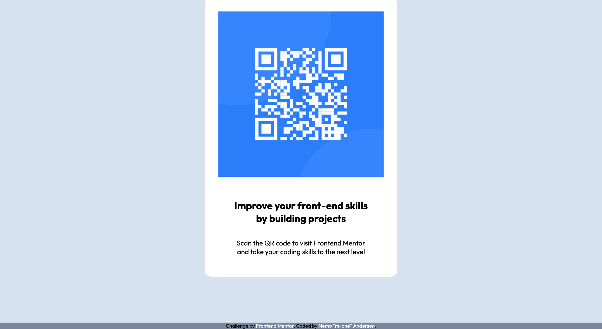

# 🧑🏾‍💻 Frontend Mentor - QR code component solution 📲

This is a solution to the [QR code component challenge on Frontend Mentor](https://www.frontendmentor.io/challenges/qr-code-component-iux_sIO_H). Frontend Mentor challenges help you improve your coding skills by building realistic projects.

## Table of contents

- [Overview](#overview)
  - [Screenshot](#screenshot)
  - [Links](#links)
- [My process](#my-process)
  - [Built with](#built-with)
  - [What I learned](#what-i-learned)
  - [Continued development](#continued-development)
  - [Useful resources](#useful-resources)
- [Author](#author)

## Overview

coming soon

### Screenshot




### Links

- Solution URL: [Add solution URL here](https://www.frontendmentor.io/solutions/qr-code-card-WAId26xE6j)
- Live Site URL: [Add live site URL here](https://nemoanderson.github.io/qr-code-component-main/)

## My process

Starting to use Mobile-first workflow but I need to check out best practices.

### Built with

- Semantic HTML5 markup
- CSS custom properties
- Flexbox
- CSS Grid
- Mobile-first workflow

### What I learned

🚧🚧 Under construction 🚧🚧🔨👷🏾

Use this section to recap over some of your major learnings while working through this project. Writing these out and providing code samples of areas you want to highlight is a great way to reinforce your own knowledge.

To see how you can add code snippets, see below:

```html
<h1>Some HTML code I'm proud of</h1>
```

```css
.proud-of-this-css {
  color: papayawhip;
}
```

```js
const proudOfThisFunc = () => {
  console.log('🎉');
};
```

If you want more help with writing markdown, we'd recommend checking out [The Markdown Guide](https://www.markdownguide.org/) to learn more.

**Note: Delete this note and the content within this section and replace with your own learnings.**

### Continued development

Need to get more familiary with Git and Github.

### Useful resources

- [More on mobile first design](https://www.uxpin.com/studio/blog/a-hands-on-guide-to-mobile-first-design/) - This helped me for designing in mobile first
- [Git best practices](https://www.freecodecamp.org/news/how-to-use-git-best-practices-for-beginners/) - This is an amazing article which helped me finally give me more clarity in git.

## Author

- Website - [Nemo Anderson](https://github.com/nemoanderson)
- Frontend Mentor - [@nemoanderson](https://www.frontendmentor.io/profile/nemoanderson)
